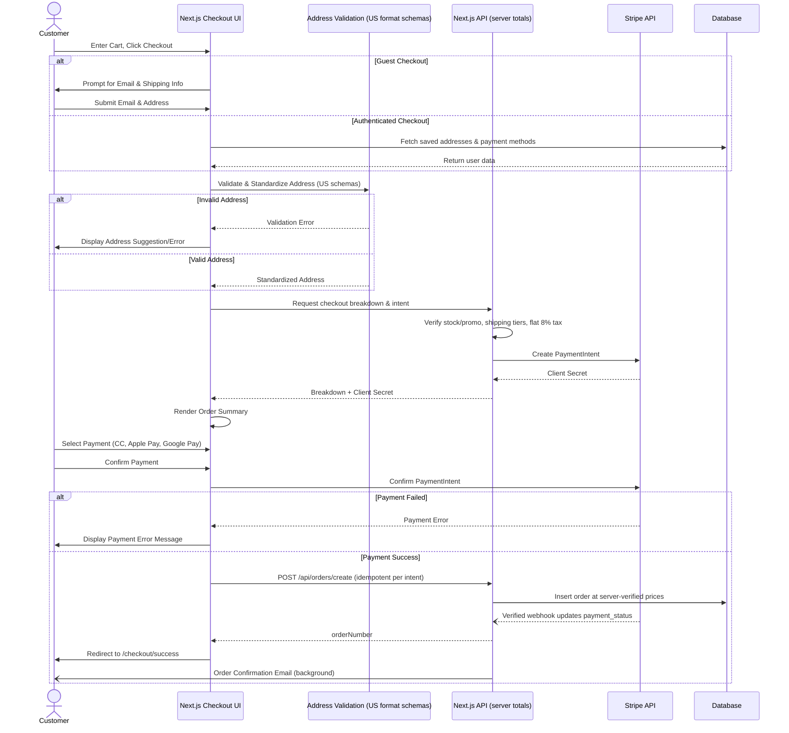

# 05 - Stealth Logistics & Checkout

## 1. Checkout Flow Specification

Our checkout flow is designed to maximize conversion while seamlessly collecting necessary information. The flow is optimized for US consumers, presenting standard US shipping, billing, and address formats.

### Checkout Flow Diagram



### Guest vs Authenticated Flows

- **Guest Checkout**:
  - Requires email, shipping address, and payment info.
  - Option to "Create Account" post-purchase.
- **Authenticated Checkout**:
  - Addresses and preferred payment methods (via Stripe Customer objects) are pre-filled.
- **Express Checkout**:
  - Apple Pay / Google Pay one-tap flow integrated at the top of the checkout process for frictionless conversion.

### Address Validation & Standardization

- Integration with **SmartyStreets** or **USPS API** to ensure US ZIP code auto-complete and address validation.
- Addresses are automatically formatted to standard US postal format before saving.

### Shipping & Tax Calculation

- **Shipping Rates** (single source of truth: `SHIPPING_RATES` in `packages/shared/src/constants`):
  - Standard (5-7 business days): $5.99
  - Express (2-3 business days): $12.99
  - Free Standard Shipping on orders over $75 (or with the `FREESHIP` promo).
- **Tax Calculation**:
  - Flat **8% estimated US sales tax** (`ESTIMATED_TAX_RATE` in the shared checkout calculator) applied to the discounted subtotal plus shipping, computed identically on web and mobile.
  - Dynamic state-by-state tax (Stripe Tax) is **not integrated yet**; the flat rate is the current behavior until it is.

### Order Summary & Error Handling

- Component clearly lists subtotal, calculated shipping, tax, and final total.
- **Error Handling**: Graceful degradation on payment failures with clear, actionable US-friendly error messages (e.g., "Your card was declined. Please check your billing zip code.").

---

## 2. Stealth Origin Strategy — Complete Playbook

To present as a 100% US-native brand while operating cross-border, every customer touchpoint must be scrubbed of foreign origin markers.

### Domain & Hosting

- **Domain**: US-focused `.com` domain.
- **Hosting**: Deployed on Vercel US-East.
- **DNS/CDN**: Cloudflare US PoPs ensuring fast load times for US traffic.

### Business Entity

- **Registration**: US LLC (Delaware or Wyoming recommended for privacy and ease).
- **Tax & Banking**: US EIN and US business bank account (e.g., Mercury, Stripe Atlas).

### Virtual US Presence

- **Address**: Virtual US business address via services like iPostal1 or a Registered Agent. Used for the footer, "About Us", contact pages, and return processing.
- **Phone**: Virtual US phone number (+1) via OpenPhone or Twilio for SMS and voicemail support.
- **Email**: Standard format, e.g., `support@yourbrand.com`.

### Shipping & Packaging

- **Carriers**: DHL eCommerce, FedEx International Priority, or Shippo for the India→US leg.
- **Packaging**: Unbranded or custom US-branded packaging. Absolutely no external supplier branding. Only legally required customs labels should indicate international origin, formatted to be as inconspicuous as legally permissible.
- **Inserts**: Packing slips and thank-you cards prominently display the US virtual address.

### Tracking Experience Masking

Direct carrier tracking links reveal origin country. We intercept and sanitize this data via a custom Tracking Proxy.

- **Custom Tracking Page**: Hosted at `/order-status/[id]`.
- **Sanitization Rules**:
  - `Origin: Delhi` → `Origin: Carrier Regional Hub`
  - `International shipment` → `Shipment in transit`
  - `Customs clearance` → `Package processing at regional hub`
  - `Export scan` → `Carrier processing`
- **Customer-Facing Timeline**:
  1. Order Placed
  2. Processing
  3. Shipped
  4. In Transit
  5. Out for Delivery
  6. Delivered
- **Estimates**: Display the real delivery windows from `SHIPPING_RATES` (5-7 standard, 2-3 express business days) without explaining why.

### Email Notifications Masking

- Sent via Resend from the US domain.
- **Content**: "Your order has been shipped!" (No mention of carrier or origin).
- **Status Updates**: Display only proxy-sanitized events.
- **React Email Templates**: Hardcode the US return address into the footer of all transactional templates.

### Legal Compliance

- **Apparel Tags**: "Made in India" labels must remain on the physical garments (US FTC requirement).
- **Customs**: Correct country of origin on commercial invoices (not visible to customer online).
- **ToS/Privacy**: If necessary to explain shipping times, use phrasing like "products are sourced globally from our manufacturing partners" without specifying India.
- **Returns**: Handled domestically via the US virtual address or a US-based 3PL.

### Customer Support Scripts

- **Q: Where does this ship from?**
  - _A: "Our products are shipped from our distribution network to ensure the fastest delivery to you."_
- **Q: Where is your company located?**
  - _A: "We are a US-based brand committed to quality and style, operating out of [New York City]."_
- **Q: Why does shipping take 14 days?**
  - _A: "We use a rigorous quality assurance process that adds a few extra days to fulfillment, ensuring you receive the absolute best product."_

---

## 3. Shipping Timeline Management

Managing expectations is key to preventing chargebacks and support tickets.

- **Day 0-1**: India warehouse picking & packing. International carrier pickup. (Status: Processing)
- **Day 2-7**: International transit. (Status: Shipped / In Transit)
- **Day 7-9**: US Customs clearance. (Status: Processing at Regional Hub)
- **Day 9-14**: US domestic delivery via USPS/FedEx. (Status: Out for Delivery / Delivered)

**Delay Communication**: If an order is stuck in customs (Day > 9), trigger an automated email:

> _"Hi [Name], we wanted to let you know your order is taking a little longer than expected to process at our carrier's regional hub. It is still on its way, and we are monitoring it closely."_

---

## 4. Returns & Exchanges Flow

Returns must feel domestic. Sending items back to India is cost-prohibitive and breaks the stealth illusion.

1. **Self-Service Initiation**: Customer initiates return via `/returns` portal.
2. **US Return Address**: Labels are generated using Shippo/EasyPost to route the package to the US Virtual Address or US 3PL.
3. **Return Label**: Customer prints a standard USPS/UPS domestic return label.
4. **Processing**: Once the tracking shows "Delivered" to the US address, the refund is automatically processed via Stripe within 3-5 business days.
5. **Inventory Disposition**: Returned goods are either batched and shipped back quarterly, resold via the US 3PL, or liquidated domestically.

---

## 5. Order Status State Machine

The backend order lifecycle defines what the customer sees and when notifications trigger.

```mermaid
stateDiagram-v2
    [*] --> PENDING_PAYMENT : Checkout Created
    PENDING_PAYMENT --> PROCESSING : Payment Success
    PENDING_PAYMENT --> FAILED : Payment Failed

    PROCESSING --> SHIPPED : Carrier Scanned (India)
    SHIPPED --> IN_TRANSIT : Transit Events

    IN_TRANSIT --> CUSTOMS_HOLD : Exception (Admin only)
    CUSTOMS_HOLD --> IN_TRANSIT : Cleared

    IN_TRANSIT --> OUT_FOR_DELIVERY : US Final Mile Scan
    OUT_FOR_DELIVERY --> DELIVERED : Delivery Scan

    DELIVERED --> RETURN_REQUESTED : Customer Initiated
    RETURN_REQUESTED --> RETURN_IN_TRANSIT : Label Scanned
    RETURN_IN_TRANSIT --> REFUNDED : Received at US Hub

    %% Notifications
    note right of PROCESSING : Trigger: Order Confirmation Email
    note right of SHIPPED : Trigger: Shipping Confirmation Email
    note right of DELIVERED : Trigger: Delivery Success Email
    note right of REFUNDED : Trigger: Refund Issued Email
```

### Admin Overrides

Customer support admins in Supabase Studio or the custom Admin Dashboard have the ability to:

- Manually transition states (e.g., force `DELIVERED` if tracking fails).
- Resend transactional emails.
- Pause tracking updates if a specific shipment has problematic origin scans that bypassed the proxy filter.
