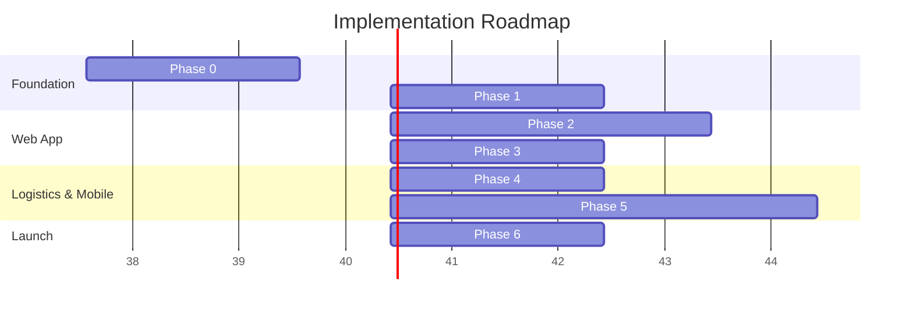

# Implementation Roadmap & Phases

This document outlines the end-to-end implementation roadmap for the B2C apparel e-commerce platform. It is broken down into seven concrete phases, starting from foundational infrastructure through to final QA and launch.

## 1. Phase Overview

## 2. Detailed Phase Breakdown

### Phase 0: Project Setup & Infrastructure (Week 1-2)

**Owner**: Tech Lead / DevOps
**Dependencies**: None
**Deliverable**: Working monorepo with deployment pipeline

- [ ] Initialize Turborepo monorepo
- [ ] Configure Next.js app with App Router, Tailwind, Shadcn UI
- [ ] Configure Expo app with Expo Router, NativeWind
- [ ] Set up `packages/shared` with TypeScript
- [ ] Create Supabase project (US-East region)
- [ ] Configure environment variables (`.env` files)
- [ ] Set up Vercel deployment with preview deployments
- [ ] Configure ESLint, Prettier, Husky pre-commit hooks
- [ ] Set up GitHub repository with branch protection
- [ ] Configure CI/CD pipeline (GitHub Actions)
- [ ] Set up error monitoring (Sentry)
- [ ] Set up analytics (Vercel Analytics, PostHog)
- [ ] Domain registration and DNS setup (Cloudflare)
- [ ] SSL certificate configuration

### Phase 1: Database & Authentication (Week 2-3)

**Owner**: Backend Lead
**Dependencies**: Phase 0
**Deliverable**: Complete database with auth working end-to-end

- [ ] Create all database tables (migration files)
- [ ] Set up all enums and custom types
- [ ] Create all indexes
- [ ] Implement all RLS policies
- [ ] Create database triggers (`updated_at`, profile creation, order number generation)
- [ ] Set up storage buckets (`product-images`, `user-avatars`)
- [ ] Generate TypeScript types from Supabase
- [ ] Implement Supabase client utilities (server, client, middleware, admin)
- [ ] Build authentication flows (signup, login, logout, password reset)
- [ ] Implement OAuth (Google, Apple)
- [ ] Build auth middleware for protected routes
- [ ] Create profile management page
- [ ] Seed database with sample categories, products, variants
- [ ] Write database utility functions (CRUD helpers)

### Phase 2: Core Storefront — Web (Week 3-6)

**Owner**: Frontend Lead
**Dependencies**: Phase 1
**Deliverable**: Fully navigable storefront with cart and wishlist

- [ ] Build shared layout (Header with nav, Footer, mobile menu)
- [ ] Implement design system tokens (colors, typography, spacing)
- [ ] Build Homepage (Hero, Featured Categories, Trending Products, Newsletter)
- [ ] Build Category listing page with filtering and sorting
- [ ] Build Product Detail Page (Gallery, Size/Color selection, Add to Cart, Tabs)
- [ ] Build Product Card component
- [ ] Implement search functionality (full-text search via Supabase)
- [ ] Build Cart page and Cart Drawer
- [ ] Implement Zustand cart store with persistence
- [ ] Build Wishlist functionality
- [ ] Build Address management (CRUD, US address format)
- [ ] Implement image optimization pipeline
- [ ] Add SEO metadata, structured data, sitemap
- [ ] Build static pages (About, Contact, FAQ, Shipping/Returns, Privacy, Terms)
- [ ] Implement loading states and skeleton screens
- [ ] Implement error boundaries and 404 page
- [ ] Add Framer Motion page transitions and micro-interactions

### Phase 3: Checkout & Payment Integration (Week 6-8)

**Owner**: Full-Stack Developer
**Dependencies**: Phase 2
**Deliverable**: Working checkout with payment processing

- [ ] Build multi-step checkout flow (Shipping → Payment → Review)
- [ ] Implement US ZIP code autocomplete and address validation
- [ ] Integrate Stripe Payment Element (Cards, Apple Pay, Google Pay)
- [ ] Integrate Razorpay as secondary payment option
- [ ] Build order creation flow (cart → order with inventory deduction)
- [ ] Implement Stripe webhook handler (`/api/webhooks/stripe`)
- [ ] Implement Razorpay webhook handler (`/api/webhooks/razorpay`)
- [ ] Build order confirmation page
- [ ] Set up transactional emails via Resend (order confirmation, shipping updates)
- [ ] Build email templates with React Email
- [ ] Implement promo code system (validation, application, tracking)
- [ ] Implement tax calculation (Stripe Tax)
- [ ] Build guest checkout flow
- [ ] Implement shipping rate calculation (flat rate tiers)
- [ ] Test complete purchase flow end-to-end

### Phase 4: Admin Dashboard & Logistics (Week 8-10)

**Owner**: Full-Stack Developer
**Dependencies**: Phase 3
**Deliverable**: Full admin panel with logistics tracking

- [ ] Build admin layout with sidebar navigation
- [ ] Build admin dashboard (stats cards, recent orders, inventory alerts, charts)
- [ ] Build product management (list, create, edit, image upload)
- [ ] Build order management (list, detail, status updates)
- [ ] Build inventory management (stock levels, low stock alerts)
- [ ] Build customer management (list, detail, order history)
- [ ] Build promo code management (CRUD)
- [ ] Implement Custom Tracking Proxy API
- [ ] Build carrier webhook ingestion endpoint
- [ ] Implement status mapping/sanitization layer
- [ ] Build customer-facing order tracking page (`/order-status/[id]`)
- [ ] Build logistics dashboard (shipment overview, carrier status)
- [ ] Implement inventory deduction trigger on order confirmation
- [ ] Build analytics page (sales charts, top products, revenue)
- [ ] Set up admin role-based access control

### Phase 5: Mobile App (Week 10-14)

**Owner**: Mobile Developer
**Dependencies**: Phase 1
**Deliverable**: Production-ready mobile app

- [ ] Set up Expo project with Expo Router
- [ ] Configure NativeWind and design tokens
- [ ] Build tab navigation (Shop, Search, Bag, Wishlist, Profile)
- [ ] Build Home screen (hero banner, categories, featured products)
- [ ] Build Category and Product listing screens
- [ ] Build Product Detail screen (image carousel, size/color selection)
- [ ] Build Cart screen and checkout flow
- [ ] Integrate Stripe React Native SDK (Apple Pay, Google Pay native)
- [ ] Build Search screen with filters
- [ ] Build Wishlist screen
- [ ] Build Profile screens (orders, addresses, settings)
- [ ] Build Order tracking screen with status timeline
- [ ] Implement push notifications (Expo Notifications)
- [ ] Implement deep linking for product and order URLs
- [ ] Implement biometric authentication
- [ ] Optimize FlatList performance
- [ ] Configure EAS Build profiles
- [ ] App Store and Google Play store listing preparation

### Phase 6: Launch Prep & QA (Week 14-16)

**Owner**: QA / Tech Lead
**Dependencies**: Phase 4 & Phase 5
**Deliverable**: Production-ready, tested, launched application

- [ ] Comprehensive cross-browser testing (Chrome, Safari, Firefox, Edge)
- [ ] Mobile responsive testing (iPhone SE through iPad Pro)
- [ ] Accessibility audit (WCAG AA compliance, screen reader testing)
- [ ] Performance audit (Lighthouse scores, Web Vitals)
- [ ] Security audit (OWASP top 10, dependency vulnerabilities)
- [ ] Load testing (Supabase connection limits, Vercel serverless cold starts)
- [ ] SEO audit (metadata, structured data, Core Web Vitals)
- [ ] Payment flow testing (all scenarios: success, failure, refund)
- [ ] Tracking proxy testing (all carrier status mappings)
- [ ] Email deliverability testing
- [ ] Legal review (Terms of Service, Privacy Policy, FTC compliance)
- [ ] Set up monitoring and alerting (uptime, error rates, performance)
- [ ] Create backup and disaster recovery plan
- [ ] Soft launch to beta users
- [ ] Iterate based on beta feedback
- [ ] Production launch 🚀

---

## 3. Risk Register

| Risk                                              | Impact | Likelihood | Mitigation                                                                                                                 |
| ------------------------------------------------- | ------ | ---------- | -------------------------------------------------------------------------------------------------------------------------- |
| **Payment gateway rejection**                     | High   | Low        | Prepare fallback accounts; ensure clear compliance with Stripe/Razorpay terms of service.                                  |
| **Shipping delays**                               | High   | Medium     | Add clear buffer times to shipping policies; proactively communicate delays to customers.                                  |
| **Customs issues**                                | High   | Medium     | Properly classify HS codes; ensure commercial invoices are correctly generated.                                            |
| **Inventory sync failures**                       | Medium | Low        | Implement robust transactional DB locks during checkout; daily reconciliation cron jobs.                                   |
| **Supabase outage**                               | High   | Low        | Multi-region read replicas (future); clear maintenance page fallbacks; automated DB backups.                               |
| **Stripe/Razorpay account holds**                 | High   | Medium     | Maintain proof of tracking and delivery; keep chargeback rates well below 1%.                                              |
| **DMCA/IP issues with product images**            | High   | Low        | Strict vetting of supplier-provided imagery; original photography for flagship items.                                      |
| **Customer discovering origin (reputation risk)** | Medium | Medium     | Position brand around quality and global sourcing; focus heavily on fast US delivery and US customer service.              |
| **App Store rejection**                           | Medium | Medium     | Follow Apple's UI guidelines carefully; ensure Guest Checkout is functional; test digital vs physical goods payment rules. |
| **Chargebacks**                                   | High   | Medium     | Use Stripe Radar; implement stringent address verification (AVS); require signatures on high-value orders.                 |

---

## 4. KPIs & Success Metrics

### Technical Metrics

- **Uptime**: > 99.9%
- **TTFB (Time to First Byte)**: < 200ms
- **LCP (Largest Contentful Paint)**: < 2.5s (Green Web Vitals)
- **Error Rates**: < 1% of total sessions

### Business Metrics

- **Conversion Rate**: Target > 2.5%
- **AOV (Average Order Value)**: Target > $75
- **CAC (Customer Acquisition Cost)**: Target < $25
- **LTV (Lifetime Value)**: Target > $150 (within 12 months)
- **Return Rate**: Target < 10%

---

## 5. Post-Launch Roadmap (Future Features)

- [ ] Reviews & ratings system (verified buyers only)
- [ ] Loyalty/rewards program (points per dollar spent)
- [ ] Referral system (give $10, get $10)
- [ ] SMS notifications (Twilio integration for shipping updates)
- [ ] AI-powered size recommendations based on past purchases
- [ ] Personalized product recommendations (Supabase Vector / Edge Functions)
- [ ] International expansion (Shipping to UK, Canada, Australia)
- [ ] Subscription/membership model (e.g., VIP free shipping tier)
